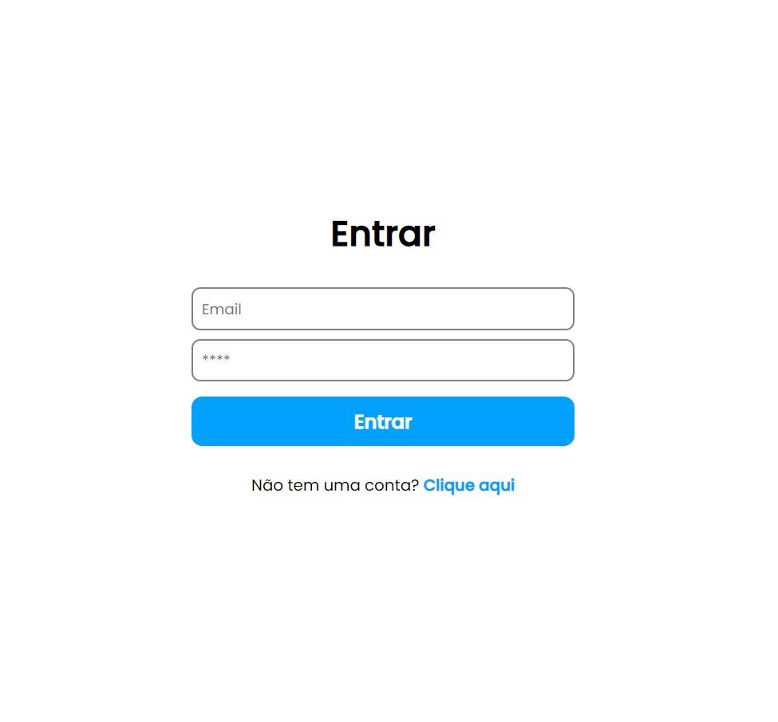
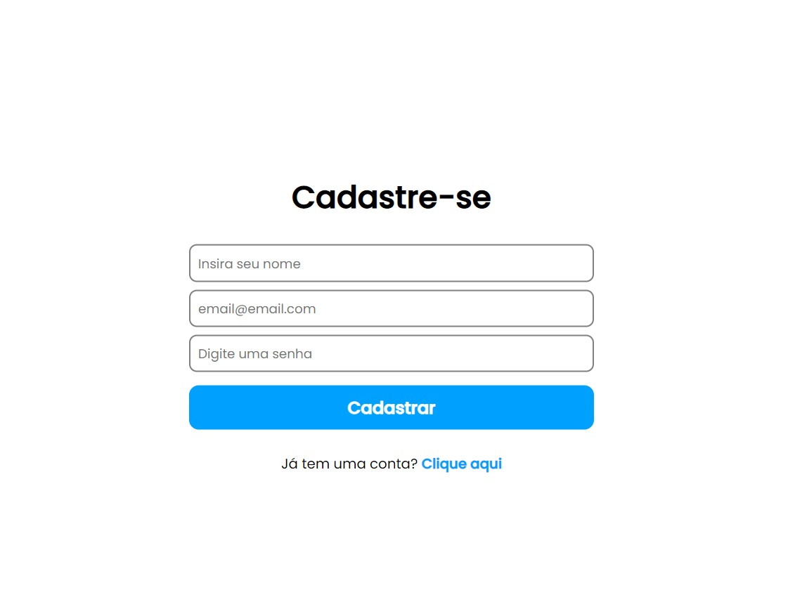

# Sistema de Login

Sistema de login criada utilizando React, NodeJS, Express com banco de dados MongoDB e autenticação em JWT.

https://sistema-de-login.netlify.app/

## Páginas

### Login

A página contém os campos de e-mail, senha e de redirecionamento para a página de cadastro caso seja um novo usuário.

   
  Imagem 01: Página de login do sistema.

Toda autenticação da página é feita em JWT e para integração com o banco de dados foi utilizado o banco NoSQL MongoDB.

### Cadastro

A página foi destinada a novos usuário e contém os seguintes campos:

- Nome;
- Email;
- Senha.

Assim que o usuário concluir o cadastro, ele será redirecionado para a Homepage do sistema. 

   
  Imagem 02: Página de cadastro do sistema.

### Homepage

Como conferência da efetividade do sistema de login, assim que o usuário for autenticado, ele será redirecionado automaticamente para essa página cujo o intuito é informar que a ação de login foi concluída com sucesso.

   
  Imagem 03: Página inicial do sistema.

## Bibliotecas, Frameworks e Banco de Dados

- [x] React;
- [x] NodeJS;
- [x] Express;
- [x] MongoDB;
- [x] JWTWebToken;
- [x] React Router Dom;
- [x] Mongoose;
- [x] BCrypt;
- [x] Axios;
- [x] Dotenv.

## Desenvolvimento

<table>
  <tr>
    <td border="1px solid #ddd" align="center">
      <a href="https://github.com/wesleysantossts">
        
         
        Wesley Santos
      </a>
    </td>
  </tr>
</table>
